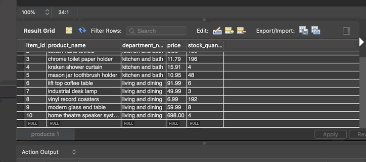

# Welcome to Bamazon

#### Tired of the unecessary UI of using a browser to order your inventory? Come to Bamazon, user of the simplicity of Node to get your orders ready faster. 

#### This app is organized by using inquirer to help you answer questions quickly after seeing the current product list from the database in SQL. 

--------------------------------------------------------------------------------------

### How it Works:

#### To start, type "node bamazonCustomer" into your terminal.
#### Bamazon will show you a list of what we have in stock. You'll be asked if you want to order from Bamazon. Of course you'll answer yes! 

#### Next, choose the item ID, or number, of the product you'd wish to purchase.

#### Then, choose your quantity. If Bamazon has enough in stock, it'll show you your total. But otherwise, it'll let you know that we don't have enough in stock.

#### Thank you for choosing Bamazon!
---------------------------------------------------------------------------------------
## See it in action:
### Bamazon products

### Choose an item with 1 quantity

### More than One Quantity

### SQL database changes in Product 9

### The technologies used in this app:
#### * node.js
#### * mysql
#### * Inquirer.js

##### I was the sole contributor to this app.